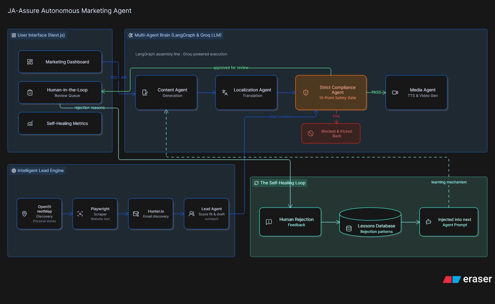
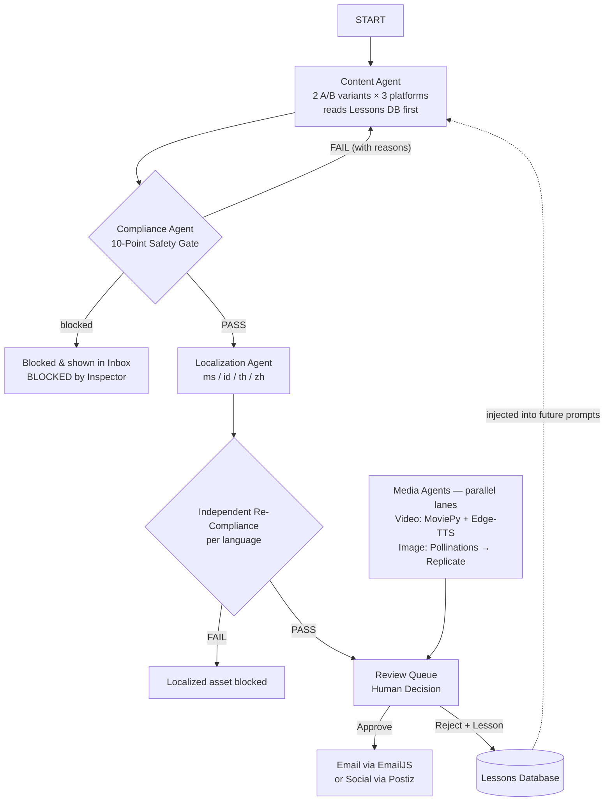

# JA-Assure Autonomous Marketing Agent



> **An autonomous marketing brain for insurance.** It finds real businesses, researches them live, drafts on-brand multilingual content, enforces insurance compliance with a second AI opinion, learns from every human rejection, renders its own images and videos, and publishes to email and social channels — all under one human approval click.

---

## ⚡ Key Points (Read This First)

| | |
|---|---|
| **What it is** | A multi-agent AI system for JA Assure (commercial insurance for jewellery retailers, clinics, and high-value logistics) that automates the entire marketing pipeline: **discover → enrich → generate → localize → compliance-check → review → publish**. |
| **Real data only** | Leads come live from **OpenStreetMap**, website text is scraped live with **Playwright**, emails are discovered with **Hunter.io**, and media is rendered/generated on the fly. **Zero mock data anywhere.** |
| **Agents that talk to each other** | The Content Agent and Compliance Agent **negotiate**: compliance blocks violating drafts with specific reasons and kicks them back; the writer rewrites; the loop repeats until the draft passes or is blocked permanently. Localization then adapts each approved draft into 4 languages — and every translated variant is **re-audited independently**. |
| **Multi-model stack** | Role-based model routing: **Qwen 3.8 27B** (generation/localization), **GPT-OSS-20B** (audit fallback lineage), **Flux / Tencent HunyuanImage 2.1** (images), **Edge-TTS + MoviePy** (voice/video) — a genuinely heterogeneous model system served through Groq. |
| **Killer feature** | The **Self-Healing Feedback Loop**: human rejections become structured "lessons" that are injected into every future prompt for that brand — rejection rate and edit intensity measurably fall over time (tracked live on the Metrics dashboard). |
| **Human in command** | Nothing is ever sent automatically. Every asset lands in the Review Queue: **Approve**, **Edit & Approve**, or **Reject & Teach**. One approve click opens a publish popup: send via **EmailJS** or post to social channels via **Postiz**. |
| **Multilingual end-to-end** | UI localized into **English, Bahasa Melayu, Thai, Bahasa Indonesia, and Chinese** (auto-detected from location); content localized natively into the same languages — each with its own compliance pass. |
| **Competitor Intelligence** | An always-on watchlist: AI discovers new competitors, **verifies their sites live** (parked/dead domains filtered), analyzes changes, and produces marketing recommendations — with a live 4-stage progress view and a 6-hourly automatic scanner. |

---

## 1. Architecture

### 1.1 System Overview

The diagram above shows the four subsystems: **User Interface (Next.js)**, the **Multi-Agent Brain (LangGraph + Groq)**, the **Intelligent Lead Engine (OSM + Playwright + Hunter.io)**, and the **Self-Healing Loop (Lessons Database)**.

### 1.2 Content Pipeline — Execution Order

The LangGraph content pipeline (`backend/app/graphs/content_pipeline.py`) runs exactly this graph:



### 1.3 Why This Order — Compliance Before Localization

Compliance validates **meaning** (guaranteed payouts, pressure tactics, absolute promises), so it gates the master draft where the rewrite loop lives — one rigorous adversarial loop instead of N diluted ones. Localization is **never a bypass**: every localized variant runs its own independent compliance audit in its own language. Compliance therefore executes **N+1 times per campaign**, catching violations that translation itself could introduce.

### 1.4 The Agents

| Agent | Code | Role | Model(s) |
|---|---|---|---|
| **Content Agent** | `agents/content.py` | Drafts 6 A/B variants (LinkedIn / Instagram / X), reads brand lessons before writing | Qwen 3.8 27B |
| **Compliance Agent** | `agents/compliance.py` | 10-rule insurance audit; blocks with flagged phrases + rule reasons; kicks drafts back | Qwen 3.8 27B (family-diverse fallback available) |
| **Localization Agent** | `agents/localization.py` | Cultural adaptation (never word-for-word) into ms/id/th/zh; re-gates every output | Qwen 3.8 27B |
| **Lead Agent** | `agents/lead.py` | Scrapes sites, scores fit 0–100, drafts personalized native-language outreach | Qwen 3.8 27B |
| **Research Agent** | `agents/research.py` | Competitor discovery/verification/analysis with a **qwen → gpt-oss-20b fallback chain** | Qwen → GPT-OSS-20B |
| **Media Agent (video)** | `agents/media.py` | Script → compliance → TTS voiceover → rendered MP4 with synced captions | Qwen + Edge-TTS + MoviePy |
| **Image Agent** | `agents/image.py` | LLM art-direction brief → image generation → media library | Qwen + Flux (Pollinations) / HunyuanImage 2.1 (Replicate) |
| **Translation Service** | `services/translation_service.py` | UI i18n cache: 219 strings × 4 languages, warmed at boot | Qwen 3.8 27B |

### 1.5 Multi-Model by Design

The system is **not a single-model wrapper**:

- **Generation** (content, localization, leads, research) → Qwen 3.8 27B
- **Audit resilience** → the Research Agent runs a real **model-family fallback chain** (`SCAN_MODELS = [qwen → gpt-oss-20b]`): if one lineage fails mid-scan, a different one takes over
- **Media** → non-LLM models entirely: Edge-TTS (voice), MoviePy (render), Flux via Pollinations (images), Tencent HunyuanImage 2.1 via Replicate (2K images)
- **Configurable routing** → every agent call takes an explicit `model_name`; role-to-model assignment is a one-line config change, and the Compliance Agent is architected as an **independent auditor** separate from the writer so different families never share failure modes

The agent-to-agent interaction is real and visible: **compliance ↔ content negotiation** (block → reason → rewrite → re-check), **localization → compliance** hand-off per language, and the **research pipeline's staged verify/analyze** hand-offs.

---

## 2. Tech Stack

| Layer | Technology |
|---|---|
| Frontend | Next.js 16 (React), vanilla CSS pastel theme, i18n (EN/MS/TH/ID/ZH) |
| Backend | Python FastAPI, SQLAlchemy, SQLite + Alembic migrations |
| AI Orchestration | LangGraph (content / lead / video graphs), FastAPI background tasks |
| LLMs | Groq — Qwen 3.8 27B (generation) + GPT-OSS-20B (fallback lineage) |
| Images | Pollinations (free Flux) with Replicate Tencent HunyuanImage 2.1 fallback |
| Video | Edge-TTS voice + MoviePy render (deterministic, 0.000s drift) |
| Data | OpenStreetMap Overpass API, Playwright scraping, Hunter.io email discovery |
| Publishing | EmailJS (outreach email) + Postiz (social channels) |
| Safety | 10-point Compliance Gate (semantic rubric) + human approval on every send |

---

## 3. What the System Does — Feature by Feature

### 3.1 Intelligent Lead Engine
Type a niche and region (e.g. *"jewellery retailers" + "Singapore"*). The engine queries **OpenStreetMap's Overpass API** for real, currently-operating businesses, **scrapes each website with Playwright**, discovers real contact emails via **Hunter.io** (with mailto-scrape and MX-verified role-guess fallbacks), scores fit 0–100 with reasons, and drafts personalized outreach in the requested language.

### 3.2 Multi-Agent Content Generation
One click generates **2 A/B variants × 3 platforms** (LinkedIn, Instagram, X) — hook-first for X, professional for LinkedIn, CTA-driven for Instagram — each variant passing through the compliance negotiation loop.

### 3.3 The 10-Point Compliance Gate
A dedicated auditor agent checks every asset against 10 insurance-marketing rules: no guaranteed payouts, no pressure tactics, no absolute promises, no unlicensed advice, and more. It flags the **exact violating phrases** with rule reasons, blocks the asset, and kicks it back for rewrite. Paraphrased violations still fail — the audit is semantic, not string-matching. Blocked assets appear in the Inbox as **"Blocked by Inspector"** with full audit reasons.

### 3.4 Localization with Independent Re-Auditing
Approved masters are culturally adapted (not translated word-for-word) into **Bahasa Melayu, Bahasa Indonesia, Thai, and Simplified Chinese** — native idioms, local tone, correct scripts (Thai glyphs, simplified characters). Each localized asset is **re-audited by the Compliance Agent independently**.

### 3.5 Human-in-the-Loop Review Queue
The Inbox groups everything by campaign topic with **LEAD / CAMPAIGN tags**, fit scores, compliance verdicts, and language tags. Decisions: **Approve As-Is**, **Edit & Approve** (creates a new content version), or **Reject & Teach** with a structured reason tag + free-text lesson.

### 3.6 One-Click Publishing
Approving a lead opens a **send-email modal** (from / to / subject / body, pre-filled, editable) wired to **EmailJS** — send and approve in one click. Approving a campaign opens the **publish popup**: a live channel picker of your connected social accounts (via Postiz) with the final content editable before **Publish Now** fans the post out to every selected channel. The publish API **refuses anything not approved** — the safety gate is enforced server-side.

### 3.7 The Self-Healing Feedback Loop
Every rejection writes a **Lesson** (reason tag + note) to the Lessons DB. Before writing anything for that brand again, agents are fed the relevant lessons. The Metrics dashboard tracks **Rejection Rate** and **Edit Intensity** over time — the mathematical proof the agent learns.

### 3.8 Competitor Intelligence
A watchlist of competitor URLs (manually added, auto-seeded majors, or AI-suggested). One merged **"Find new competitors"** button runs a live 4-stage pipeline — **AI brainstorm → verify sites (live scrape, parked/dead filtered) → analyze each → results** — streamed to the UI as per-stage progress. A scheduled scanner re-scans the watchlist **every 6 hours**, but only pages whose content **hash actually changed** are re-analyzed — token spend stays proportional to real market movement. Every digest ends with a concrete **"Suggested action"** for JA Assure's marketing team.

### 3.9 Media Generation
- **Video**: script → compliance → Edge-TTS voiceover → MP4 with word-synced slide-up captions (verified 0.000s drift, caption pixels frame-verified)
- **Images**: LLM art-direction brief → free **Pollinations/Flux** generation (retry-hardened) with **Replicate HunyuanImage 2.1** as a configured fallback — thumbnails appear directly in the Inbox

### 3.10 Multilingual UI
The entire dashboard auto-detects your language from location/browser and can be switched live between **EN / MS / TH / ID / ZH** — including AI-generated content, which is translated on the fly via the cached translation service.

---

## 4. Running It

The demo environment ships **pre-configured** — all keys are already in place; judges don't configure anything.

```bash
# Backend
cd backend
python -m venv venv && venv\Scripts\activate      # or source venv/bin/activate
pip install -r requirements.txt
python -m playwright install chromium
alembic upgrade head
python db/seed/seed_brands.py
uvicorn app.main:app --port 8000                  # API docs: /docs

# Frontend
cd frontend
npm install
npm run dev                                       # http://localhost:3000
```

### Environment reference (pre-configured in the demo)

| Variable | Purpose |
|---|---|
| `GROQ_API_KEY` | LLM inference for all agents |
| `HUNTER_API_KEY` | Live email discovery |
| `IMAGE_PROVIDER` | `auto` (default): free Pollinations first, Replicate fallback |
| `REPLICATE_API_TOKEN` / `REPLICATE_IMAGE_MODEL` | Optional Replicate image fallback (HunyuanImage 2.1) |
| `POSTIZ_API_KEY` | Social channel publishing |
| `NEXT_PUBLIC_EMAILJS_*` (frontend) | Outreach email sending |

Every integration **degrades gracefully**: if a service is unreachable the feature reports it honestly and the rest of the pipeline keeps running — the system never fabricates data.

**Code quality:** the entire backend passes `ruff check` (lint) and `mypy` (static type checking) with **zero findings** across all 44 modules — enforced as part of the development loop, not bolted on.

---

## 5. Executable Proofs

Live verification scripts in `backend/tests/` — run from `backend/`:

| Script | Proves |
|---|---|
| `verify_feedback.py` | A rejection note structurally rewrites the LLM's next output |
| `verify_osm.py` | Raw Overpass JSON → DB rows → drafted outreach |
| `verify_compliance.py` | Paraphrased violations blocked by rubric meaning |
| `verify_lead_compliance.py` | Kickback offers blocked; lead status frozen |
| `verify_multilingual.py` | Bahasa Indonesia localization + independent compliance |
| `verify_multilingual_thzh.py` | Thai script + Simplified Chinese verified |
| `verify_research.py` | Competitor digest only on hash mutation |
| `verify_video.py` | TTS + MP4 render, 0.000s sync, caption pixels confirmed |
| `verify_hunter.py` | Live Hunter.io email discovery |

---

## 6. Judge FAQ

**Why is Localization after the Content/Compliance stage?**
Compliance audits *meaning*, so it gates the master draft where the adversarial rewrite loop lives — one strong loop instead of N weak ones. Localization is never a bypass: every translated variant re-runs compliance independently, so compliance runs **N+1 times per campaign** and catches violations introduced by translation itself.

**Do all agents use one model?**
No. The stack is deliberately heterogeneous: Qwen 3.8 27B drives generation roles; GPT-OSS-20B provides a second model lineage as the research fallback; images come from Flux and Tencent HunyuanImage 2.1; voice/video from Edge-TTS + MoviePy. Role-to-model routing is a per-agent config (`model_name` on every call), and the auditor is architecturally separated from the writer so the two can be placed on different families.

**How do agents "talk to each other"?**
Concretely, over LangGraph edges: the Compliance Agent returns structured verdicts that the Content Agent must satisfy (block → reasons → rewrite → re-check); the Localization Agent hands each output to its own compliance pass; the Research pipeline streams discover → verify → analyze hand-offs; and the Lessons DB feeds every agent's prompt context.

**Is any data mocked?**
No. OpenStreetMap for leads, Playwright for site text, Hunter.io for emails, Groq for inference, Pollinations/Replicate for images. Failures degrade gracefully and visibly — they never fabricate.

**What stops an illegal insurance claim from being published?**
Three layers: constrained prompts, the semantic 10-point Compliance Gate (a separate auditor from the writer), and mandatory human approval before any send/publish — enforced again server-side by the publish API.

---

## 7. Repository Map

```
backend/
  app/
    agents/        # content, compliance, localization, lead, media, image, research, lessons
    api/           # pipeline, review, dashboard, publish, translate
    graphs/        # LangGraph pipelines (content, lead)
    services/      # llm_client, osm, scraping, hunter, replicate/pollinations,
                   # tts_video, translation, postiz, groq key pool
    models/        # SQLAlchemy models (assets, reviews, feedback, lessons, leads, media…)
    tests/         # executable proofs (see §5)
  alembic/         # migrations
  db/seed/         # brand + demo seeding
frontend/
  src/app/         # dashboard, leads, queue, competitors, metrics
  src/components/  # Select, LanguageSwitcher…
  src/i18n/        # 5-language translations + live translation client
docs/
  architecture/    # system diagram
media/             # generated images & videos
```
